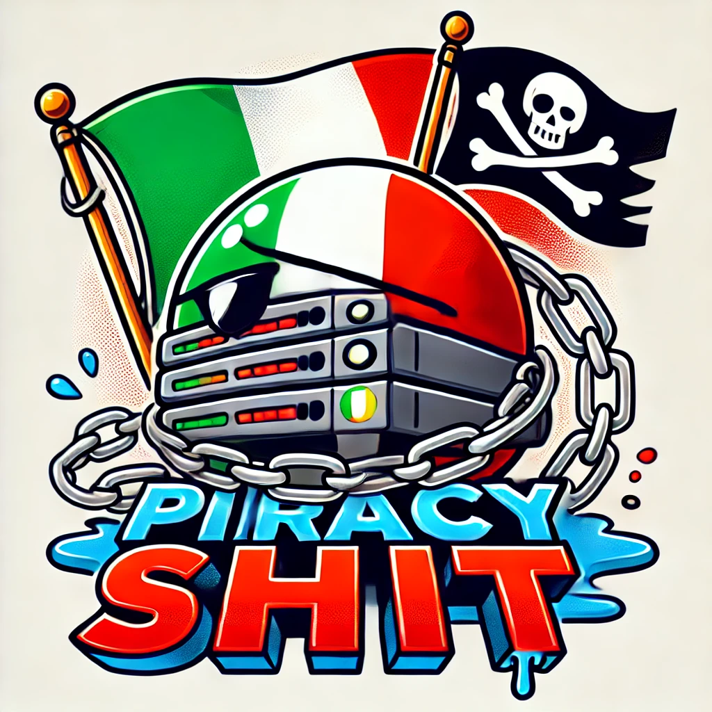

# Piracy Shit

Un archivio di tutte le volte in cui Piracy Shield ha bloccato contenuti legittimi. Raccolgo anche post di persone autorevoli in materia che evidenziano problemi relativi al Piracy Shield 

### Come contribuire?

1. Clona il repo `git@github.com:andp97/piracy-shit.git`
2. Aggiungi un articolo in formato markdown qui: [src/content/blog](/src/content/blog) copiando da [questo articolo](/src/content/blog/piracy-shield-vs-google-drive.md) come template 
3. Crea una [PR](https://github.com/andp97/piracy-shit/compare)

